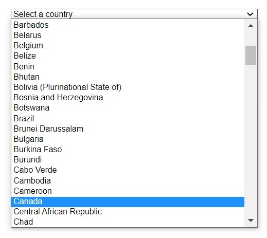
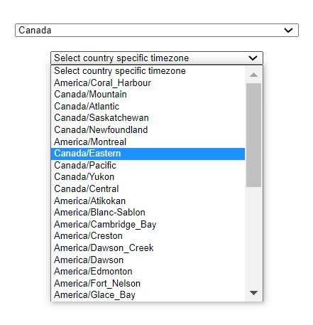
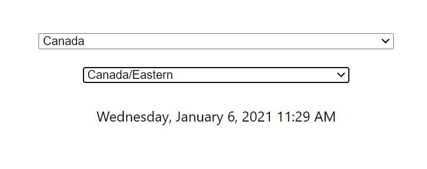

# World Clock

This application was created as a personal project to get the current time of a particular time zone.

The application uses two packages
- countries-and-timezones
- moment.js

Countries-and-Timezones is installed using ```npm install --save countries-and-timezones```. This package gives us the list of all the countries in the world, and their corresponding timezones by using the country specific alpha2 code. Since some countries have more than one timezone, it returns and array of timezones if a country having multiple timezones is selected.

Moment.js provides us with the current date and time of the selected timezone. It can be installed using ```npm install moment-timezone```.

## Running the application

Once the project is opened in VS Code, open two different terminals. In the first terminal write ```cd frontend``` followed by ```yarn dev:frontend``` to start the frontend server, and in the second terminal write ```cd backend``` followd by ```yarn dev:backend``` to start the backend server.

Once the servers are running, you can see the the select option that allows you to select the country.



After the country selection, a new drop down menu appears that prompts you to select the country spcific time zone. 



Once a particular timezone is selected, you are able to see the current date and time of that timezone.



Enjoy!